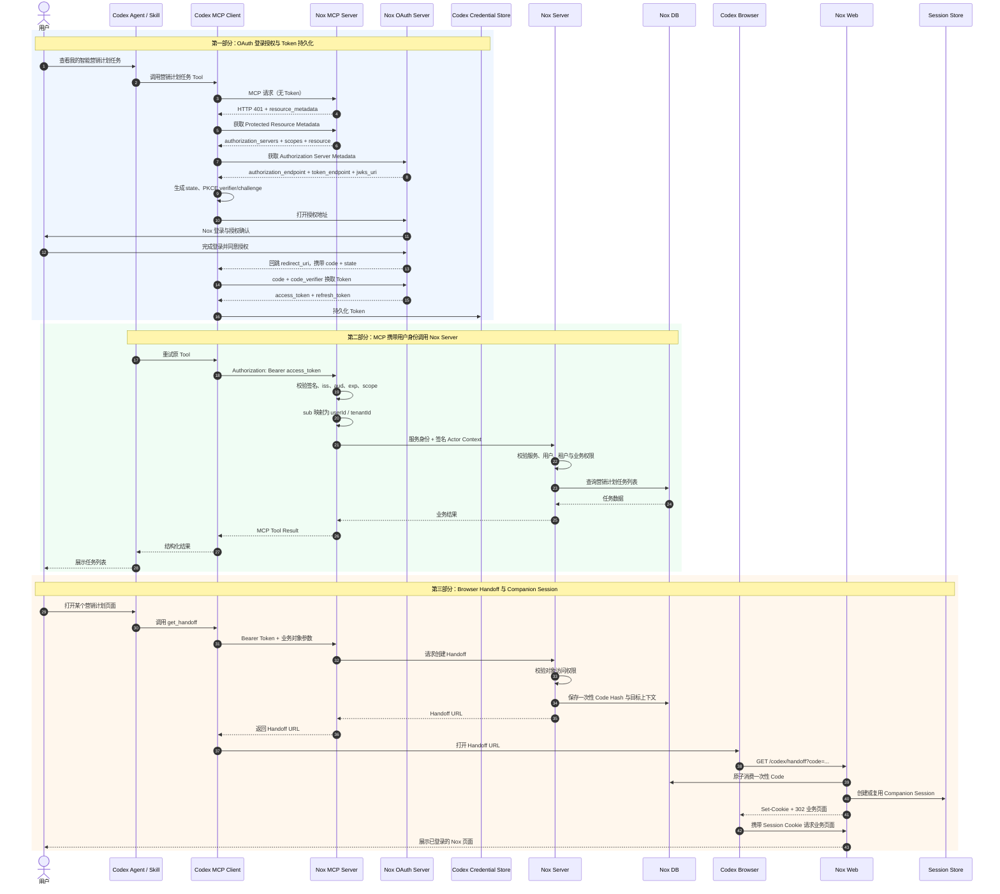
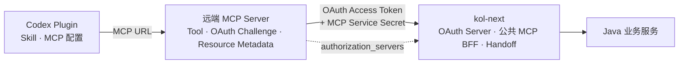

# NoxInfluencer Codex Plugin 登录授权与 Session 持久化闭环方案

> 文档状态：MVP 技术方案
> 适用范围：NoxInfluencer Codex Plugin 首期 Demo/MVP
> 首期业务目标：通过 Codex 查看当前用户有权限访问的智能营销计划任务列表

## 1. 文档目标

本文定义 NoxInfluencer Codex Plugin 在以下三条链路中的职责边界、交互步骤、身份传递方式和数据存储位置：

1. Codex MCP Client 与 Nox OAuth Server 之间的登录授权及 Token 持久化；
2. Nox MCP Server 携带用户身份调用 Nox Server 查询业务数据；
3. Codex 打开 Nox 网页时，通过 Browser Handoff 建立 Companion Web Session。

核心目标是形成完整闭环：用户在 Codex 中完成一次 Nox 授权后，Codex 可以持续调用 Nox MCP；需要展示网页时，可以安全地打开与该用户身份一致的 Nox 业务页面。

## 2. 核心结论

- Skill 不负责登录、不保存 Token，也不在代码里内置固定用户 Key。Skill 只描述何时及如何使用 MCP Tool。
- OAuth 不是通过 `get_oauth` Tool 发起的。MCP 对未授权请求返回 HTTP `401`，Codex MCP Client 根据 OAuth Metadata 自动完成授权。
- Codex MCP Client 后续调用 MCP 时固定使用 `Authorization: Bearer <access_token>` 传递授权结果。
- `access_token` 是可过期、可轮换的访问凭证，不是永久用户标识。稳定用户身份来自 Token 中的 `sub`，并映射到 Nox `userId`。
- MCP 必须在每次请求中校验 Access Token，不能只在首次请求时校验后永久缓存身份。
- MCP 调用 Nox Server 时，推荐使用“服务身份 + 已签名的用户上下文”，不能只传一个可伪造的 `X-User-Id`。
- Browser Handoff 使用短期、一次性 Code 换取网页 Session Cookie；Access Token 不进入浏览器 Cookie，也不暴露在业务页面 URL 中。
- OAuth Grant 可以跨 Codex 对话持续有效，但不保证所有对话和浏览器实例共享同一个网页 Session ID。

## 3. 参与方与职责

| 参与方 | 主要职责 |
| --- | --- |
| 用户 | 在 Codex 发起业务请求；在 Nox 授权页完成登录和授权 |
| Skill / Agent | 理解用户意图、选择 MCP Tool、组织 Tool 参数；不处理 OAuth 凭证 |
| Codex MCP Client | 发现 OAuth 配置、执行 PKCE 授权码流程、保存并刷新 Token、携带 Bearer Token 调用 MCP |
| Nox MCP Server | 暴露 MCP Tool；发布 Protected Resource Metadata；校验 Access Token；构造当前请求的用户身份上下文 |
| Nox OAuth Server | 登录、授权、签发和刷新 Token；维护 OAuth Client、Grant、Refresh Token 和签名密钥 |
| Nox Server | 根据可信用户身份执行现有业务权限校验、查询营销计划任务、创建 Handoff Code |
| Nox Web | 消费一次性 Handoff Code、创建 Companion Session、设置 Cookie、展示业务页面 |
| Codex Browser | 打开 Handoff URL；保存 Nox Web 设置的 Session Cookie |

## 4. 总体流程图



## 5. 第一部分：OAuth 登录授权与 Token 持久化

### 5.1 首次未授权调用

1. 用户在 Codex 中提出“查看我的智能营销计划任务”等业务请求。
2. Agent 根据 Skill 的说明选择对应的 MCP Tool。
3. Codex MCP Client 调用 Nox MCP Server。首次调用时没有 Nox Access Token。
4. MCP 返回 HTTP `401 Unauthorized`，并通过 `WWW-Authenticate` 告诉 Client 去哪里获取 Protected Resource Metadata。

响应示意：

```http
HTTP/1.1 401 Unauthorized
WWW-Authenticate: Bearer resource_metadata="https://api.noxinfluencer.com/.well-known/oauth-protected-resource/mcp"
```

这里不存在自定义的 `get_oauth` MCP Tool。OAuth 是 MCP Client 对 HTTP 鉴权挑战的标准处理流程。

### 5.2 两类 OAuth Metadata

#### 5.2.1 MCP Protected Resource Metadata

由 Nox MCP Server 提供，例如：

```text
GET https://api.noxinfluencer.com/.well-known/oauth-protected-resource/mcp
```

建议返回：

```json
{
  "resource": "https://api.noxinfluencer.com/mcp",
  "authorization_servers": [
    "https://accounts.noxinfluencer.com"
  ],
  "scopes_supported": [
    "marketing_plan:read",
    "handoff:create"
  ]
}
```

此 Metadata 告诉 Codex：当前 MCP 是哪个受保护资源、应使用哪个 OAuth Server、支持哪些 Scope。

#### 5.2.2 OAuth Authorization Server Metadata

由 Nox OAuth Server 提供，例如：

```text
GET https://accounts.noxinfluencer.com/.well-known/oauth-authorization-server
```

建议至少发布：

- `issuer`
- `authorization_endpoint`
- `token_endpoint`
- `jwks_uri`
- `scopes_supported`
- `grant_types_supported`
- `code_challenge_methods_supported`
- Client 注册方式：预注册、CIMD 或 DCR，按最终接入能力决定

### 5.3 创建授权请求

Codex MCP Client 读取两类 Metadata 后完成以下工作：

1. 确定 Nox OAuth Server 的授权地址和 Token 地址；
2. 使用已登记或动态注册得到的 `client_id`；
3. 使用 Codex 提供的 `redirect_uri`；
4. 生成随机 `state` 防止登录请求被串改；
5. 生成 PKCE `code_verifier` 和 `code_challenge`；
6. 带上所需的 `scope` 和 MCP `resource`；
7. 在浏览器中打开 Nox 授权页面。

授权请求示意：

```text
GET /authorize?
  response_type=code&
  client_id=<codex-oauth-client-id>&
  redirect_uri=<codex-callback-uri>&
  scope=marketing_plan%3Aread%20handoff%3Acreate&
  resource=https%3A%2F%2Fapi.noxinfluencer.com%2Fmcp&
  state=<random-state>&
  code_challenge=<pkce-challenge>&
  code_challenge_method=S256
```

`client_id` 表示 Codex/OpenAI Host 这个 OAuth Client，不表示当前 Nox 用户。`redirect_uri` 只在 OAuth 流程中使用，不会在每次 MCP 业务请求中重复传递。

### 5.4 用户登录、授权与回跳

1. Nox OAuth Server 验证 `client_id`、`redirect_uri`、`scope`、`resource` 和 PKCE 参数是否合法。
2. 用户在 Nox 授权页面完成登录；若当前浏览器已有可用的 Nox 登录态，可复用现有登录态。
3. OAuth Server 展示授权确认并记录用户同意的 Scope。
4. OAuth Server 创建 OAuth Grant，并生成短期、一次性的 Authorization Code。
5. OAuth Server 将浏览器回跳到 Codex 提供的 `redirect_uri`，只携带 `code` 和 `state`。

```text
<codex-callback-uri>?code=<authorization-code>&state=<original-state>
```

授权页不会把 Access Token 和 Refresh Token直接放在浏览器回跳 URL 中。

### 5.5 Code 换取 Token

Codex MCP Client 收到回跳后：

1. 校验回传的 `state`；
2. 向 Nox OAuth Server 的 `token_endpoint` 发起后端请求；
3. 提交 `code`、原始 `code_verifier`、`client_id`、`redirect_uri` 和 `resource`；
4. OAuth Server 校验 Code 未过期、未使用，并校验 PKCE；
5. OAuth Server 返回短期 Access Token 和可轮换的 Refresh Token。

```json
{
  "token_type": "Bearer",
  "access_token": "<jwt-access-token>",
  "expires_in": 3600,
  "refresh_token": "<opaque-refresh-token>",
  "scope": "marketing_plan:read handoff:create"
}
```

### 5.6 Token 结构与用户身份

MVP 推荐使用短期 JWT Access Token，建议 Claims 至少包含：

```json
{
  "iss": "https://accounts.noxinfluencer.com",
  "sub": "<stable-nox-subject>",
  "uid": "<nox-user-id>",
  "tenant_id": "<current-tenant-id>",
  "aud": "https://api.noxinfluencer.com/mcp",
  "scope": "marketing_plan:read handoff:create",
  "iat": 1786579200,
  "exp": 1786582800,
  "jti": "<token-id>"
}
```

约束：

- `sub` 是 OAuth 世界中的稳定主体标识；
- `uid` 是 Nox 业务用户 ID；
- `tenant_id` 表示当前租户上下文，多租户关系仍须由 Nox Server 二次校验；
- `aud` 必须绑定 Nox MCP Resource，避免 Token 被其他服务误用；
- Access Token 建议有效期 30～60 分钟；
- Refresh Token 建议服务端持久化、轮换、可撤销；
- OAuth Server 使用私钥签名 JWT，通过 `jwks_uri` 发布公钥。

### 5.7 Token 保存与刷新

- Access Token 和 Refresh Token 由 Codex/OpenAI Host 的凭证存储管理，不写入 Plugin、Skill、项目文件或浏览器 Cookie。
- Nox 无需知道 Codex 的本地物理存储路径，只需正确实现 Token Endpoint、Refresh Token Grant、轮换和撤销。
- Access Token 过期后，Codex MCP Client 应使用 Refresh Token 向 Nox OAuth Server 换取新 Token。
- 如果 Refresh Token 失效、过期或被撤销，MCP Client 需要重新触发用户授权。
- Codex 不同版本或接入表面对自动刷新和凭证存储的具体实现可能不同，联调阶段必须做真实端到端验证。

## 6. 第二部分：MCP 调用 Nox Server

### 6.1 MCP Client 传递什么身份信息

授权完成后，Codex MCP Client 重新调用原来的 Tool，并在 MCP HTTP 请求中携带：

```http
Authorization: Bearer <access-token>
```

正常业务请求不携带以下 OAuth 流程参数：

- `client_id`
- `redirect_uri`
- Authorization Code
- `code_verifier`
- Refresh Token

其中 Refresh Token 只发送给 OAuth Server 的 Token Endpoint，不能发送给 MCP Tool 或 Nox Server。

### 6.2 MCP 每次请求必须执行的校验

MCP 收到 Bearer Token 后，应执行：

1. 从 Nox OAuth Server 的 `jwks_uri` 获取公钥；
2. 按 `kid` 选择正确公钥并校验 JWT 签名；
3. 校验 `iss` 是否为预期的 Nox OAuth Issuer；
4. 校验 `aud` 或 `resource` 是否指向当前 Nox MCP；
5. 校验 `exp`、`nbf`、`iat` 等时间字段；
6. 校验调用当前 Tool 所需的 Scope；
7. 从 `sub`、`uid`、`tenant_id` 构造当前请求的 `ToolPrincipal`。

示意：

```text
ToolPrincipal
├── subject
├── userId
├── tenantId
├── scopes
├── tokenId
└── expiresAt
```

`ToolPrincipal` 只存在于当前请求内存中，不是需要长期持久化的 MCP 用户 Session。

MCP 可以缓存 JWKS，也可以短期缓存 `sub -> userId` 映射以提高性能，但缓存不能替代每次请求的 Token 校验。

### 6.3 MCP 向 Nox Server 传递可信身份

推荐采用两层身份：

1. 服务身份：证明请求来自可信的 Nox MCP Server；
2. 用户上下文：证明这次服务调用代表哪个 Nox 用户和租户。

内部请求示意：

```http
Authorization: Bearer <mcp-service-token>
X-Nox-Actor-Context: <short-lived-signed-context>
X-Trace-Id: <trace-id>
```

签名后的 Actor Context 建议包含：

```json
{
  "subject": "<oauth-sub>",
  "userId": "<nox-user-id>",
  "tenantId": "<tenant-id>",
  "scopes": ["marketing_plan:read"],
  "source": "codex",
  "issuedAt": 1786579200,
  "expiresAt": 1786579260,
  "traceId": "<trace-id>"
}
```

不要只发送裸的 `X-User-Id`，否则任何能访问 Nox Server 的调用方都可能伪造其他用户。

### 6.4 Nox Server 执行业务授权

Nox Server 收到内部调用后：

1. 校验 MCP Service Token；
2. 校验 Actor Context 的签名和有效期；
3. 确认 `userId`、`tenantId` 当前仍有效；
4. 校验用户是否属于该租户；
5. 校验用户角色和营销计划任务的对象级权限；
6. 查询当前用户可见的任务列表；
7. 记录审计日志和 `traceId`；
8. 将结果返回 MCP，再由 MCP 返回 Codex。

MCP 负责“确认调用者是谁以及拥有哪些 OAuth Scope”；Nox Server 负责“这个用户当前是否可以访问这个业务对象”。二者不能互相替代。

## 7. 第三部分：Browser Handoff 与 Companion Session

### 7.1 为什么需要 Handoff

MCP Access Token 适用于 Codex MCP Client 调用 Nox MCP，不应直接写入浏览器 Cookie，也不应拼进普通业务页面 URL。

当 Codex 需要打开 Nox 网页时，必须把已验证的 MCP 用户身份安全地转换为一个短期网页 Session。这个转换过程就是 Browser Handoff。

### 7.2 创建 Handoff URL

1. Agent 调用 `get_handoff` Tool。
2. Tool 参数只包含业务对象，例如营销计划 ID、任务 ID、目标页面类型；不允许传 `userId`、`tenantId` 或任意跳转 URL。
3. Codex MCP Client 正常携带 Bearer Access Token。
4. MCP 校验 Token 并得到 `ToolPrincipal`。
5. MCP 使用服务身份和 Actor Context 调用 Nox Server 的内部 Handoff API。
6. Nox Server 根据 Actor Context 校验用户是否有权访问目标对象。
7. Nox Server 根据服务端白名单把页面类型映射到固定业务路由。
8. Nox Server 生成高熵随机 Code，只保存 Code Hash。
9. Nox Server 返回完整的 Handoff URL。

示意 URL：

```text
https://www.noxinfluencer.com/codex/handoff?code=<one-time-code>
```

Handoff 域名和入口路径由部署配置确定，例如 `HANDOFF_PUBLIC_BASE_URL`；最终业务路径由服务端白名单映射，不能接受 Agent 传入任意 Redirect URL。

### 7.3 Handoff Code 存储

可使用 Redis 或数据库保存以下结构：

```text
HandoffRecord
├── codeHash
├── userId
├── tenantId
├── targetType
├── targetObjectId
├── targetPath
├── surface = codex
├── createdAt
├── expiresAt
└── consumedAt
```

安全要求：

- Code 使用安全随机数生成器产生；
- 服务端只保存 Code Hash，不保存明文；
- 建议有效期 5 分钟；
- 只能使用一次；
- 消费操作必须原子化，防止并发重放；
- 使用后立即标记 `consumedAt`；
- 日志不得记录完整 Code。

### 7.4 创建 Companion Web Session

1. Codex Browser 打开 Handoff URL。
2. Nox Web 的 Handoff Endpoint 对 Code 做 Hash，并在 Redis/数据库中原子消费记录。
3. Web 校验 Code 未过期、未使用，目标对象和用户仍有效。
4. Web 创建新的 Companion Session，或者在同一浏览器已有有效 Companion Session 时按策略复用。
5. Web 在浏览器中设置 Session Cookie。
6. Web 返回 `302`，跳转到不包含 Code 的正式业务页面。
7. 后续网页请求携带 Session Cookie，Nox Web 从服务端 Session Store 恢复用户身份。

Cookie 建议：

```http
Set-Cookie: nox_companion_session=<random-session-id>; Path=/; HttpOnly; Secure; SameSite=Lax
```

Cookie 中只存随机 Session ID，不存以下内容：

- Access Token
- Refresh Token
- Handoff Code
- 用户 ID
- 租户 ID

服务端 Session Store 建议保存：

```text
CompanionSession
├── sessionIdHash
├── userId
├── tenantId
├── type = companion
├── createdAt
├── expiresAt
├── lastSeenAt
└── revokedAt
```

### 7.5 Primary Session 与 Companion Session

- Primary Web Session：用户在自己的普通浏览器中直接登录 Nox 后建立，沿用现有登录和单设备策略。
- Companion Web Session：通过 Codex Browser Handoff 建立，生命周期较短，与 Primary Session 隔离。
- Companion Session 不应挤掉用户现有的 Primary Session。
- Companion Session 建议有效期 2～8 小时，具体时长由安全要求决定。
- 用户退出 Nox、账号禁用、权限撤销或安全事件发生时，应支持主动撤销相关 Companion Session。

### 7.6 跨 Codex 对话的持久化语义

能够保证的是：

- 只要 Codex 保存的 OAuth Grant/Refresh Token 仍有效，新对话仍可调用 Nox MCP；
- 新对话需要打开网页时，可以再次调用 `get_handoff`，无需用户重新输入 Nox 账号密码；
- 同一 Codex Browser Profile 中若 Companion Cookie 仍有效，Nox Web 可以复用现有 Companion Session。

不能保证的是：

- 所有 Codex 对话共享同一个网页 Session ID；
- 不同 Browser Profile、隔离容器或设备共享同一个 Cookie；
- Cookie 或 Refresh Token 过期、撤销后仍然保持登录。

因此，系统保证的是“同一 Nox 授权关系可跨对话恢复访问能力”，而不是“永远复用同一个网页 Session”。

## 8. 数据存储归属

| 数据 | 存储位置 | 说明 |
| --- | --- | --- |
| MCP URL、Resource 配置 | Plugin 的 `.mcp.json` | 可公开的连接配置，不包含用户凭证 |
| OAuth Protected Resource Metadata | Nox MCP Server | 描述 MCP Resource、OAuth Server 和 Scope |
| OAuth Authorization Server Metadata | Nox OAuth Server | 描述授权、Token、JWKS 等 Endpoint |
| OAuth Client | OAuth Server 数据库/配置 | `client_id`、允许的 `redirect_uri` 等 |
| OAuth Grant | OAuth Server 数据库 | 用户对 Client 和 Scope 的授权关系 |
| Authorization Code | OAuth Server 短期存储 | 短期、一次性、绑定 PKCE 和 Redirect URI |
| Access Token | Codex Credential Store | Codex MCP Client 使用；短期有效 |
| Refresh Token | Codex Credential Store | Codex 持有；OAuth Server 保存 Hash/状态用于轮换撤销 |
| JWT 签名私钥 | KMS / Secret Manager | 仅 OAuth Server 可用，不进入代码仓库 |
| JWKS 公钥 | OAuth Server `jwks_uri` | MCP 获取并缓存，用于 JWT 验签 |
| ToolPrincipal | MCP 当前请求内存 | 不持久化为登录 Session |
| MCP Service Token | Secret Manager | MCP 调用 Nox Server 的服务身份 |
| Nox 用户、租户、权限、任务 | Nox 业务数据库 | Nox Server 是业务权限事实源 |
| Handoff Code Hash | Redis / 数据库 | 短期、一次性；不保存明文 Code |
| Companion Session | Nox Session Store | 保存 Web Session 与用户身份映射 |
| Companion Cookie | Codex Browser Cookie Store | 只保存随机 Session ID |
| 审计日志 | Nox 日志/审计平台 | 记录授权、Tool 调用、Handoff、Session 和权限决策 |

## 9. 生命周期建议

| 对象 | 建议生命周期 | 到期后的处理 |
| --- | --- | --- |
| Authorization Code | 1～5 分钟、一次性 | 重新发起 OAuth 授权 |
| Access Token | 30～60 分钟 | 使用 Refresh Token 刷新 |
| Refresh Token | 7～30 天或按安全策略 | 轮换；失效后重新授权 |
| Actor Context | 30～120 秒 | MCP 为下一次内部调用重新签发 |
| Handoff Code | 5 分钟、一次性 | 重新调用 `get_handoff` |
| Companion Session | 2～8 小时 | 重新执行 Handoff，不一定需要重新 OAuth |
| Primary Web Session | 沿用 Nox 现有策略 | 用户按现有流程重新登录 |

以上数值是 MVP 建议，最终需由安全、产品体验和现有 Nox 登录策略共同确认。

## 10. MVP 实现范围

### 10.1 必须实现

- MCP Protected Resource Metadata；
- OAuth Authorization Server Metadata；
- Authorization Code + PKCE；
- Access Token、Refresh Token 签发和刷新；
- JWT Access Token 与 JWKS；
- MCP 每请求验签、Issuer/Audience/过期时间/Scope 校验；
- `sub -> Nox userId/tenantId` 的稳定映射；
- MCP 服务身份与签名 Actor Context；
- 查询当前用户智能营销计划任务列表的 MCP Tool；
- `get_handoff` Tool；
- 一次性 Handoff Code；
- Companion Session Cookie；
- 关键链路审计日志和 Trace ID。

### 10.2 暂不扩展

- 在 Skill 中内置固定用户 Key；
- Skill 自己维护登录状态；
- 把 MCP Server 打包进 Plugin；
- 把 Access Token 写入业务网页 Cookie；
- 允许 Agent 指定任意跳转 URL；
- 用裸用户 ID 代替可验证的用户上下文；
- 为 MVP 同时实现大量业务 Tool。

## 11. 实现前必须确认的决策

1. Nox 现有用户表中哪个字段作为不可变的 OAuth `sub`；
2. 用户和租户是一对一、一对多还是需要授权时选择租户；
3. JWT 签名算法、密钥托管方式和 JWKS 轮换方案；
4. Access Token、Refresh Token、Handoff 和 Companion Session 的最终有效期；
5. Refresh Token 的轮换、撤销和重放检测策略；
6. Codex OAuth Client 使用预注册、CIMD 还是 DCR；
7. Codex 实际提供的 `redirect_uri` 及其白名单配置；
8. 首期 Scope 是否只保留 `marketing_plan:read` 和 `handoff:create`；
9. Nox Server 如何验证 MCP Service Token 和 Actor Context；
10. Companion Session 是否复用、何时撤销，以及是否与现有风控联动。

## 12. MVP 验收场景

1. 首次调用任务列表 Tool 时，Codex 能自动拉起 Nox OAuth 授权页。
2. 授权成功后，Codex 能自动重试原 Tool 并返回当前用户的任务列表。
3. Access Token 过期后可使用 Refresh Token 恢复调用，无需用户重新登录。
4. Token 签名错误、Issuer/Audience 不匹配、过期或 Scope 不足时，MCP 明确拒绝请求。
5. 用户不能通过修改 Tool 参数越权查询其他用户或其他租户任务。
6. MCP 到 Nox Server 的用户上下文不能被普通调用方伪造。
7. `get_handoff` 只为当前用户有权限的业务对象生成 URL。
8. Handoff Code 使用一次后立即失效，并在超时后不可使用。
9. Handoff 完成后，浏览器地址栏不再包含 Code，Cookie 中不包含 OAuth Token。
10. 新 Codex 对话在 OAuth Grant 仍有效时可继续调用 MCP，并可重新建立 Companion Session。
11. 撤销授权、禁用用户或撤销 Session 后，后续请求及时失效。
12. 登录、Tool 调用、业务查询、Handoff 和 Session 创建可以通过同一 `traceId` 追踪。

## 13. 官方协议参考

- [OpenAI Plugin Authentication](https://developers.openai.com/plugins/build/auth)
- [Model Context Protocol Authorization](https://modelcontextprotocol.io/specification/latest/basic/authorization)
- [OAuth 2.0 Protected Resource Metadata（RFC 9728）](https://www.rfc-editor.org/rfc/rfc9728)
- [OAuth 2.0 Authorization Server Metadata（RFC 8414）](https://www.rfc-editor.org/rfc/rfc8414)
- [Proof Key for Code Exchange（RFC 7636）](https://www.rfc-editor.org/rfc/rfc7636)

## 14. 最终职责边界

- Codex MCP Client：发现 OAuth、完成授权、保存和刷新 Token、携带 Bearer Token 调用 MCP。
- Nox OAuth Server：确认用户身份、维护 OAuth Grant、签发/刷新/撤销 Token、发布 JWKS。
- Nox MCP Server：每次校验 Access Token，构造当前请求的可信用户身份，向 Nox Server 发起受控的内部调用。
- Nox Server：以现有业务数据为事实源，执行租户、角色和对象级权限校验，查询任务并创建 Handoff。
- Nox Web：一次性消费 Handoff Code，建立短期 Companion Session，并安全展示业务页面。
- Skill：描述业务意图与 Tool 使用方式，不接触凭证，不承担 OAuth 或 Web Session 职责。

## 15. Plugin、MCP Server 与 kol-next 的解耦部署

本方案采用“Plugin、远端 MCP Server、kol-next 分别部署”的架构。三者通过 MCP、OAuth 和 HTTPS API 等稳定协议连接，不通过代码仓绑定或固定部署关系耦合。



### 15.1 组件职责边界

| 组件 | 负责内容 | 不负责内容 |
| --- | --- | --- |
| Codex Plugin / Skill | 安装 Skill、声明 MCP Server、指导 Agent 使用 Tool | 不保存 Token、uid、Service Secret；不直连 kol-next BFF 或 Java |
| 远端 MCP Server | MCP 协议、Tool、Schema、OAuth 保护、Protected Resource Metadata、调用 kol-next 公共 MCP BFF | 不维护 Nox 业务事实；不直接访问 Java 数据库；不创建网页 Cookie |
| kol-next OAuth Server | 登录授权、Authorization Code + PKCE、Access/Refresh Token、撤销和 OAuth Metadata | 不主动调用 MCP Server；不需要配置 MCP Server URL |
| kol-next 公共 MCP BFF | 验证 MCP Server 服务身份和用户 Access Token，建立可信请求主体，向具体业务 BFF 提供 uid | 不负责 MCP 协议；不把 uid 作为独立身份接口返回给模型 |
| 业务 BFF / Application Service | 参数、对象权限、套餐、额度、事务、幂等和业务错误 | 不信任 Tool 自报 uid；不绕过业务 Server |

MCP Server 可以自行选择连接哪个 kol-next 环境。本地、测试和生产 MCP Server 可以分别连接对应环境；kol-next 不需要知道 MCP Server 的 URL，只需通过 Service Secret、mTLS 或等价的服务身份判断调用方是否可信。

### 15.2 三类地址与环境配置

必须区分以下三个地址：

| 地址 | 作用 | 由谁配置 |
| --- | --- | --- |
| `KOL_NEXT_BASE_URL` / OAuth issuer | 登录、授权、Token、Handoff 和 BFF 所在的 kol-next 地址 | kol-next 和 MCP Server |
| `MCP_SERVER_URL` | Codex Plugin 连接的 MCP 协议地址 | Plugin / MCP Server 部署 |
| `MCP_RESOURCE` | OAuth Token 的 audience/resource，即 MCP Server 受保护资源标识 | Plugin、MCP Server、kol-next |

三者不能混用。Plugin 连接的是 MCP Server，不是 kol-next BFF；MCP Server 再调用 kol-next 的 `/api/v2/mcp/*`。

环境配置建议如下：

| 环境 | kol-next OAuth issuer / Handoff | MCP Server / Resource | MCP Server 调用的 kol-next BFF |
| --- | --- | --- | --- |
| 本地 | `http://www.noxinfluencer.com:3322` | 本地 MCP Server，例如 `http://127.0.0.1:23000/mcp` | `http://www.noxinfluencer.com:3322/api/v2/mcp` |
| 测试 | `https://www--yf.noxinfluencer.com` | 测试 MCP Server 的正式地址 | `https://www--yf.noxinfluencer.com/api/v2/mcp` |
| 生产 | `https://www.noxinfluencer.com` | `https://api.noxinfluencer.com/mcp` | `https://www.noxinfluencer.com/api/v2/mcp` |

正式发布的 Plugin 固定指向生产 MCP Server；本地和测试使用独立开发包或构建时选择的 `.mcp.json`，不让 Agent 在运行时自行切换环境。

生产环境至少要保证以下值完全一致：

```text
Plugin .mcp.json 的 oauth_resource
MCP Server Protected Resource Metadata 的 resource
kol-next MCP_OAUTH.publicResource
Access Token 的 aud
```

例如生产统一使用：

```text
MCP Resource: https://api.noxinfluencer.com/mcp
OAuth issuer: https://www.noxinfluencer.com
```

`MCP_RESOURCE` 是受保护资源标识，不代表 kol-next 需要主动访问该 MCP Server。若一个 kol-next 环境同时服务多个 MCP Server，应使用受控 Resource 白名单，并为每个 MCP Server 使用不同的 Service Secret；不能通过放宽 audience 校验解决环境混用问题。

### 15.3 公共 MCP BFF 鉴权层

所有 MCP 业务请求先进入公共 MCP BFF 鉴权层，再进入具体业务 BFF。公共层统一校验：

```http
Authorization: Bearer <用户 OAuth Access Token>
X-Nox-MCP-Authorization: Bearer <MCP Service Secret>
```

校验成功后，仅在服务端请求上下文中生成可信主体：

```json
{
  "uid": "真实用户 uid",
  "parentUid": "主账号 uid",
  "clientId": "OAuth client",
  "grantId": "OAuth grant",
  "resource": "MCP resource",
  "scope": ["noxinfluencer.user"]
}
```

具体业务 BFF 使用服务端上下文中的 `uid` 调用 Java，并在内部 Header 注入可信用户身份。MCP Tool 请求、Query、Body 和 Plugin 配置都不得提供或覆盖 uid。

配额不足、对象不存在等属于业务错误，应由业务 BFF 保留稳定的业务错误码和可读消息，不能误报为 OAuth 失败；Token 失效、Resource 不匹配和权限范围不足则分别按 401/403 处理。
